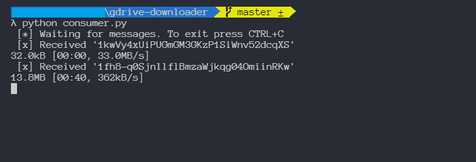

# Google Drive Batch Downloader
Download files from Google Drive in the queue


## Setup
- Install depedencies
	```bash
	$ pip install -r requirements.txt
	```
- Run your RabbitMQ service
- Fill your RabbitMQ configuration into env
- Enter the google drive id that you want to download on the ids_list variable



All downloaded files are output in the ```downloads``` folder